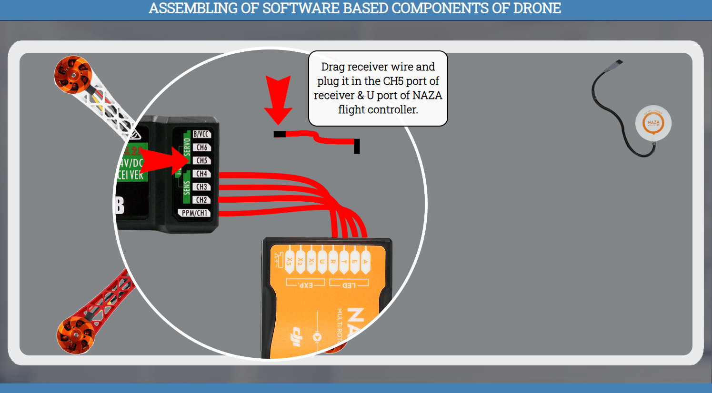

### Procedure

#### Assembling of Drone's Sofware Based Components

#### Click Here to Enter the Lab
#### 

### click the next button
#### 

### click the ok button
#### 

### click on center plate to flip the plate
#### 

<!--
#### Precautions:
#### 1. No cell phone or ear phone usage in the laboratories.  
#### 2. Know locations of laboratory safety showers, eyewashstations, and fire extinguishers
#### 3. Determine the potential hazards before beginning any work.
#### 4. Avoid wearing jewellery in the lab as this can pose multiple safety hazards.
#### 5. Long hair and loose clothing must be pulled back and secured.
#### 6. Avoid contact with energized electrical circuits.
#### 7. Do not touch anything if your hands are wet. The "one-hand" approach is safest.
#### 8. Do not make circuit changes or perform any wiring when power is on.
#### 9. All equipment should be regularly inspected for wear or deterioration.
#### 10. Know emergency exit routes.
-->

#### Drag double sided tape and put it on the center plate.
#### 

### click the ok button
#### 

#### Drag NAZA flight controller and put it on the tape to fix it with the plate.
#### 

#### Drag PMU wire and plug it in the X3 port of NAZA flight controller.
#### 

#### Drag PMU EXP pin and plug it in the EXP port of NAZA flight controller.
#### 

#### Drag ESCs wires one by one and plug them in the M1, M2, M3 & M4 port of NAZA flight controller.
#### 

### click on PMU to fix it on the arm
#### 

#### Drag Cable tie and put it on the PMU to tie PMU with the arm.
#### 

### click the next button
#### 

### Choose the option and click on the submit button
#### 

### click the next button
#### 

#### Drag double sided tape and put it on the center plate.
#### 

### click the ok button
#### 

#### Drag receiver and put it on the tape to fix it with the plate.
#### 

#### Drag receiver wires and put it near the center plate.
#### 

#### Drag receiver wire and plug it in the CH1 port of receiver & A port of NAZA flight controller.
#### 

#### Drag receiver wire and plug it in the CH2 port of receiver & E port of NAZA flight controller.
#### 

#### Drag receiver wire and plug it in the CH3 port of receiver & T port of NAZA flight controller.
#### 

#### Drag receiver wire and plug it in the CH4 port of receiver & R port of NAZA flight controller.
#### 

#### Drag receiver wire and plug it in the CH5 port of receiver & U port of NAZA flight controller.
#### 

### click the ok button
#### 

#### Drag GPS and drop it near the center plate.
#### 

#### Drag GPS wire and fix it in the GPS port of PMU.
#### 

### click the next button
#### 

### Choose the option and click on the submit button
#### 

### click the next button
#### 

### click the ok button
#### 

#### Drag top plate and put it on the arms.
#### 

#### Drag screws one by one and put them on the top plate.
#### 

#### Drag Allen key and drop it on the screw to tight all four screws.
#### 

#### NOTE :Repeat the same process with other screws to fix the top plate.
### click the next button
#### 

### Choose the option and click on the submit button
#### 

### click the next button
#### 

#### Click on top plate to flip the quadcopter.
#### 

### click the ok button
#### 

#### Drag landing gear and put it on the center plate.
#### 

#### Drag screws one by one and put them on gear.
#### 

#### Drag Allen key and drop it on the screw to tight both screws.
#### 

#### NOTE :Repeat the same process with other three gears.
### click the next button
#### 

### Choose the option and click on the submit button
#### 

### click the next button
#### 

#### Click on quadcopter to flip the quadcopter.
#### 

### click the ok button
#### 

#### Drag propeller and put it on the motor.
#### 

#### Drag propeller nut and put it on the propeller.
#### 

#### Drag wrench and put it on the propeller nut to tight the nut.
#### 

#### NOTE :Repeat the same process with other three propellers.
### click the next button
#### 

### Choose the option and click on the submit button
#### 

### click the next button
#### 

#### Click on top plate for zoom view.
#### 

#### Drag double sided tape and put it on the top plate.
#### 

#### Drag GPS stand and put it on the tape to fix it with top plate.
#### 

#### Drag another double sided tape and put it on the GPS stand.
#### 

#### Drag GPS and fix it on the GPS stand.
#### 

### click the next button
#### 

### Choose the option and click on the submit button
#### 

### click the next button
#### 

#### Click on top plate for zoom view.
#### 

#### Drag battery strip and put it on the top plate.
#### 

### click the ok button
#### 

### Drag battery and put it on the top plate.
#### 

#### Click on battery strip to fix battery with quadcopter.
#### 

#### Drag battery female socket and fix it with the male socket of deans plug.
#### 

#### Software based components of drone assembled successfully.

### click the next button
#### 

#### Thank You For Performing the Experiment
#### 

