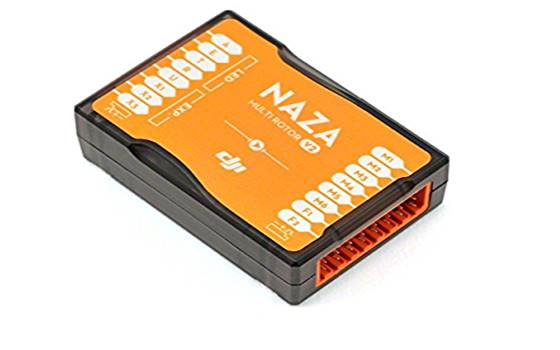
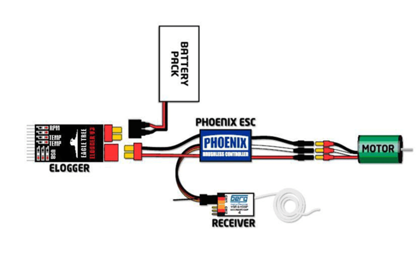
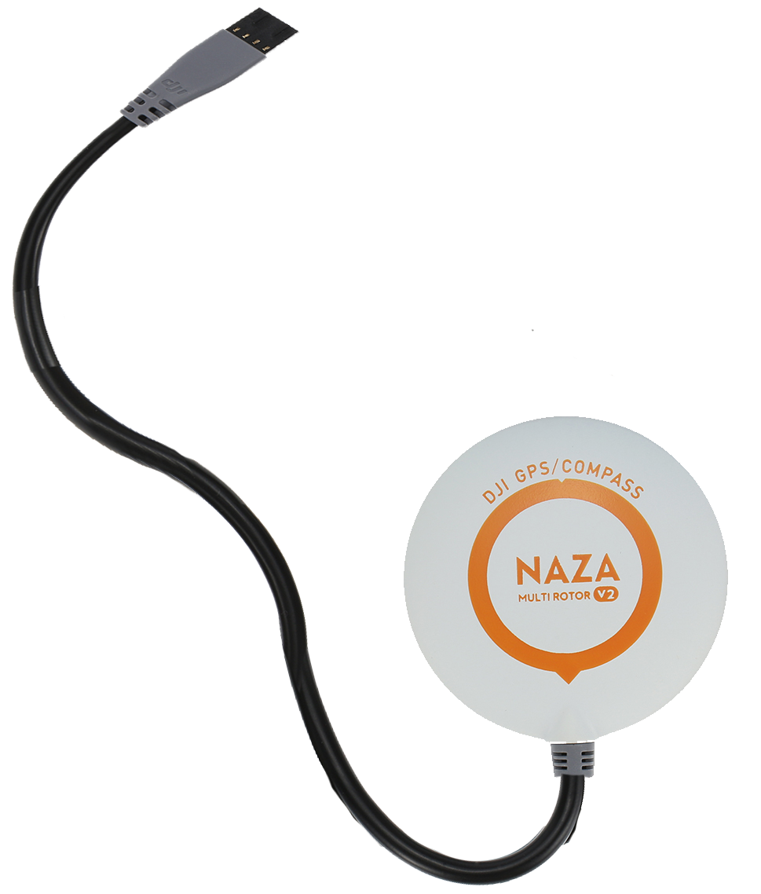
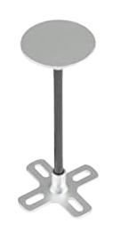

### Theory

#### DEFINITION OF DRONE(QUADCOPTER)

Quadcopter is an unmanned aerial vehicle (UAV) or drone with four rotors,each with a motor and propeller.A quadcopter can be manually controlled or can be autonomous.It is also called quadcopter helicopter or quadrotor.It belongs to a more general class of aerial vehicles called multicopter or multirotor.Quadcopters provide stable flight performance,making them ideal for surveillance and aerial photography.

  

 

#### PRINCIPLE OF DRONE(QUADCOPTER)

Quadcopters generally have two rotors spinning clockwise (CW) and two counterclockwise (CCW). Flight control is provided by independent variation of the speed and hence lift and torque of each rotor. Pitch and roll are controlled by varying the net centre of thrust, with yaw controlled by varying the net torque. 
Unlike conventional helicopters, quadcopters do not usually have cyclic pitch control, in which the angle of the blades varies dynamically as they turn around the rotor hub. In the early days of flight, quadcopters (then referred to either as 'quadrotors' or simply as 'helicopters') were seen as a possible solution to some of the persistent problems in vertical flight. Torque-induced control issues (as well as efficiency issues originating from the tail rotor, which generates no useful lift) can be eliminated by counter-rotation, and the relatively short blades are much easier to construct. A number of manned designs appeared in the 1920s and 1930s. These vehicles were among the first successful heavier-than-air vertical take off and landing (VTOL) vehicles. However, early prototypes suffered from poor performance, and latter prototypes required too much pilot work load, due to poor stability augmentation and limited control authority. 

#### COMPONENTS OF DRONE(software based)

The first step to building a drone is to understand the components that it required for operation.
every drone consist of following basic and essential parts 

#### PDB(Power Distribution Board)

PDB stands for Power Distribution Board, and it is often where the battery power lead is connected. The connection is done such that the female connector in the battery wire is plugged into the male connector in the PDB (usually the connectors used are XT60 types).

These days, the necessity of using a PDB is being reduced because FCs, ESCs, and other components (often called AIO or All-In-One) can perform the same function. These components have a wide input voltage range and can be connected to the battery voltage (aka VBAT). They can then output a stable voltage, i.e., 5V, to power an FPV camera or other components.

##### Builder’s Tip:
Make sure your PDB is actually necessary. Nowadays, it’s likely that you can distribute power to your components by other means. For example, some VTXs have a wide input range and can output a regulated 5V to power your FPV camera.

##### Note:
AIO is a common term used for components that can fulfill more than one function. For example, an AIO FPV camera is a camera and VTX (video transmitter) integrated into one unit.

  

 

#### Wiring components

These are used in interconnection of various components of drone like PBD's,FLV's etc.

 

 

#### RX (Radio reciever)

Transmitters (TX) and receivers (RX) are not universal and you need to buy an RX that is compatible with your TX, an FrSky Taranis transmitter cannot work with a FlySky receiver. These days it is most likely that you will be using either PPM or a digital Serial protocol, which will only require 1 signal wire for all of the channels, plus power (3.3v or 5v) and GND.The signal wire will be connected to one of the UART terminals on your FC (Flight Controller). Some FC’s actually have integrated receivers, if you are taking this route make sure that it is using a compatible protocol.
 
Builders tip : Make a note of which UART you have connected your RX to, so you can easily configure the FC to communicate with the RX in BetaFlight Configurator.

#### Note: Spektrum based receivers usually require 3.3v while FrSky and FlySky RX require 5v. Never supply 5v to an RX that only requires 3.3v!

  

 

#### NAZA Flight Controller 

The Flight Controller (aka “FC”) is the brain of a quadcopter, it has sensors on the board so it can understand how the craft is moving. Using the data provided by these sensors, the FC uses algorithms to calculate how fast each motor should be spinning for the craft to behave as the pilot is instructing via stick inputs on the TX (Radio Transmitter). Most of the wiring on your quad will be focussed around the FC. It needs to have the RX (receiver) connected, so it can be told what the pilot wants the craft to do. Each of the ESC signal and ground wires need to be connected for the FC commands to be carried out by the motors. 
 Builders tip: More functions often means more wires. For beginners an “all singing, all dancing” FC might sound fantastic, but the wiring might become very tightly spaced making it difficult to solder. Remember to test fit your components to your frame before you start trimming wires. measure twice, cut once!

#### Note: Some AIO FC’s will have a selection of various different components integrated onto the board from receivers to VTX, now even ESC’s are being integrated with FC’s though this is quite controversial.

  

 

#### Roles of a Flight Controller (FC) in a Drone

- **Sensor Data Processing** – Collects and processes data from accelerometers, gyroscopes, barometers, and GPS for stable flight.
- **Stability and Balance Control** – Adjusts motor speeds to maintain level flight and counteract external forces like wind.
- **Flight Mode Management** – Supports different flight modes such as manual, altitude hold, GPS-assisted, and autonomous modes.
- **Motor and ESC Control** – Sends precise signals to ESCs, which regulate motor speed for smooth maneuvering.
- **Navigation and Positioning** – Works with GPS and other sensors to enable autonomous navigation and waypoint missions.
- **Failsafe Functions** – Activates Return-to-Home (RTH) and emergency landing features in case of signal loss or low battery.
- **Communication with Remote Controller** – Receives pilot commands and translates them into drone movements.
- **Telemetry and Data Logging** – Records flight data, battery status, and sensor readings for monitoring and analysis.
- **Obstacle Avoidance** – In advanced drones, integrates with sensors to detect and avoid obstacles.
- **Payload Management** – Helps control attached devices like cameras, gimbals, or delivery payloads.

Builders tip : If you are using an FC with an integrated PDB then all 4 wires going to the ESC input will come from the FC. 4-in-1 ESC’s are becoming popular as they can shave a few grams off your AUW (All Up Weight or takeoff weight inc. Battery and other peripherals). A 4-in-1 ESC can connect to the FC in different ways, and they are not universal – Unless you know exactly what you are getting, I advise you purchase a 4-in-1 ESC as a stack combined with the FC such as the Holybro Kakute FC and tekkoS 4-in-1 ESC.

#### Note: The specs provided on the data sheets of motors are under static thrust test conditions. Props spin easier in free air and therefore motors use between 20% and 30% less current in flight conditions than that shown in static tests. If the maximum amperage draw of a motor is the same or just under the maximum current rating of your ESC it should be fine.

  

 

#### Propellers

There are possibly thousands of different types of propeller for quadcopters, with multiple options in almost every size. A heavier propeller will require more torque from the motor than a lighter prop, also blades with a higher AOA (Angle Of Attack – aka “aggressive props”) encounter more resistance from the air and require more torque. When a motor has to work hard to turn, it draws more Amps. Finding a balance between the thrust produced and the amperage used by the prop and motor combination is a balancing act that every quad pilot goes through, there is no “right answer”.
 
Builders tip : Remember that your props have to be really tight, it helps to have a tool to grip the motors while tightening the prop nuts. If the props slip this will cause erratic behaviour in flight.

#### Note: Props these days are generally well made, but they may still be unbalanced. If you are getting vibration or ‘jello’ in your camera, check your props are undamaged, unbent and balanced, before your start disassembling!

 

 

#### Batteries

LiPo batteries are the power sources of the quadcopters. LiPo is used because of the high energy density and high discharge rate. LiPo batteries are rated by their nominal voltage (3.7v per cell), cell count in series, (shown as a number followed by ‘S’) ie 4S = 14.8v, capacity in mAh (ie.1300mAh) and discharge rate or ‘C’ rating (ie. 75C). If you want to know more here is an article on LiPo battery C ratings.
 
Builders tip: The battery is the single heaviest component of your quad, just because you put a bigger battery on it, it doesn’t mean it will fly longer.

#### Note: buying cheap “no name” batteries is not recommended you will find inconsistencies in cell voltage, inflated claims of capacity, and they will suffer from “voltage sag”.

 

 

#### Battery strip

Battery strip is used to bind the battery with the drone. Note, all these arrangements are made such that the center of mass of the drone is aligned and not shifted towards any particular side.
 

 

#### GPS module

GPS (Global Positioning System) is an essential component in drones, enabling precise navigation and autonomous flight. It allows the drone to determine its real-time location, altitude, and speed by receiving signals from multiple satellites.
 

 

##### Functions of GPS in Drones:
- **Position Hold** – Helps the drone maintain a stable position in the air without drifting.
- **Return to Home (RTH)** – Enables the drone to automatically return to its takeoff point in case of signal loss or low battery.
- **Waypoint Navigation** – Allows the drone to follow a pre-programmed flight path for automated missions.
- **Geofencing** – Prevents drones from flying into restricted or dangerous areas by setting virtual boundaries.
- **Speed and Altitude Monitoring** – Provides real-time flight data, ensuring controlled and safe operation.
- **Enhanced Stability** – Improves flight accuracy, especially in windy conditions, by continuously adjusting position.

#### GPS module stand

GPS module stand provides a stable platform above surface of drone for connectinf satellite.
 

 

#### Top plate

Top plate is usually needed to cover the various components of drone,so that damage can be reduced at the time of crash.components are protected between top plate and center plate,as it safeguard against motion fluctuations.
 

 

#### Landing gear

The landing gear adds an extre protection to your flying platform and all other precious equipments i,n particular for electric aircraft with vertical take-off such as drones, which in addition to having a structural support function,it also provide an elevation to a drone on surface.
 

 

